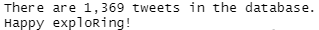

# tweetexploR

<!-- badges: start -->

<!-- badges: end -->

tweetexploR is an R package for exploring and visualising a collection of Tweets that has been tidied into an SQLite database file by the [tidy_tweet](https://pypi.org/project/tidy-tweet/) library.

tweetexploR allows you to quickly answer questions such as:

| Question                                                | Function name                |
|---------------------------------------------------------|------------------------------|
| How many tweets are there per hour/day/month?           | `num_tweets_by_timeperiod()` |
| How many times did each user post a tweet?              | `num_tweets_by_username()`   |
| How many unique users posted tweets per hour/day/month? | `num_users_by_timeperiod()`  |
| What are the most frequently used hashtags?             | `top_n_hashtags()`           |
| Which tweets were liked the most?                       | `top_n_liked_tweets()`       |
| Who is being mentioned the most?                        | `top_n_mentions()`           |
| Who is being replied to the most?                       | `top_n_replied_to_tweets()`  |
| Which tweets were retweeted the most?                   | `top_n_retweeted_tweets()`   |
| Which accounts were retweeted the most?                 | `top_n_retweeted_accounts()` |
| What are the engagement metrics for the tweets?         | `engagement_summary()`       |

Under the hood, tweetexploR uses [ggplot2](https://ggplot2.tidyverse.org/) to create nicely formatted charts, and even allows you to tweak them to suit your own preferences. tweetexploR also gives you the option to export the data underlying each visualisation by using the `return_data = TRUE` parameter.

## Installation

You can install the development version of tweetexploR from [GitHub](https://github.com/) with:

``` r
# install.packages("devtools")
devtools::install_github("QUT-Digital-Observatory/tweetexploR")
```

## Tutorial

### 1. Connect to a tidy_tweet SQLite database

The first step is to connect to your SQLite database of Tweets that you created using [tidy_tweet](https://pypi.org/project/tidy-tweet/). If you haven't got your tidy_tweet SQLite database yet, follow the instructions in the [tidy_tweet](https://pypi.org/project/tidy-tweet/) documentation.

Your tidy_tweet SQLite database should be a file ending in `.db`. You'll need to know the path to the `.db` file in order to connect to it.

``` r
sqlite_con <- connect_to_sqlite_db("my_database.db")
```

It is recommended that you save your connection to the SQLite database as an object in your environment so that you can use it with all of the other tweetexploR functions. A suggested name is `sqlite_con`.

Once you have connected to the SQLite database, you should receive a message to let you know how many tweets were found in the database:



### 2. Create some visualisations

The following code creates a bar chart of the top 10 hashtags and saves it as an object in your environment called `top_10_hashtags`. The code assumes that you called your SQLite database connection `sqlite_con`.

``` r
library(tweetexploR)
top_10_hashtags <- top_n_hashtags(sqlite_con, n = 10)
```

If you'd like to tweak the chart, you can specify parameters to pass to `geom_col()` such as `fill = "blue"`. You can also add you own theme or use one of the [complete themes](https://ggplot2.tidyverse.org/reference/ggtheme.html) such as `theme_minimal()`:

``` r
top_10_hashtags <- top_n_hashtags(sqlite_con, n = 10, fill = "blue") +
  theme_minimal()
```

You can [save your chart](https://ggplot2.tidyverse.org/reference/ggsave.html) using `ggplot2::ggsave()` in the same way that you would save any other ggplot chart:

``` r
ggsave(filename = "my_awesome_chart.png", width = 12, height = 8, units = "cm")
```

The following code creates a line chart of the number of tweets per day and saves it as an object in your environment called `tweets_per_day`. It will also return the underlying data as a data frame by using `return_data = TRUE`. Again, the code assumes that you called your SQLite database connection `sqlite_con`.

```r
library(tweetexploR)
tweets_per_day <- num_tweets_by_timeperiod(sqlite_con, period = "day", return_data = TRUE)
```

To access the chart:

```r
tweets_per_day$chart
```

To access the underlying data as a data frame:

```r
tweets_per_day$data
```

The following code generates a data frame that summarises the engagement metrics for all tweets in the database. Again, the code assumes that you called your SQLite database connection `sqlite_con`.

```r
library(tweetexploR)
engagement_summary <- engagement_summary(sqlite_con)
```

### 3. Disconnect from your database

Once you've finished exploRing, it's good practice to disconnect from your SQLite database:

``` r
DBI::dbDisconnect(sqlite_con)
```

## Feedback and contributions

We appreciate all feedback and contributions!

Issues (documentation improvements, bug reports, and feature requests/discussions) are always welcome on our GitHub, as are pull requests.

If you found an error or if something was unclear to you, please [file an issue on our GitHub](https://github.com/QUT-Digital-Observatory/tweetexploR/issues) for us to fix. We will do our best to respond to all issues, and appreciate your time and feedback. Alternatively, you can submit a pull request with your own changes.


## About tweetexploR

tweetexploR is created and maintained by the [QUT Digital Observatory](https://www.qut.edu.au/digital-observatory) and is open-sourced under an MIT license. We welcome contributions and feedback!

To cite this package:
QUT Digital Observatory (2023): tweetexploR. Queensland University of Technology. (Software) https://doi.org/10.25912/RDF_1676860790823
